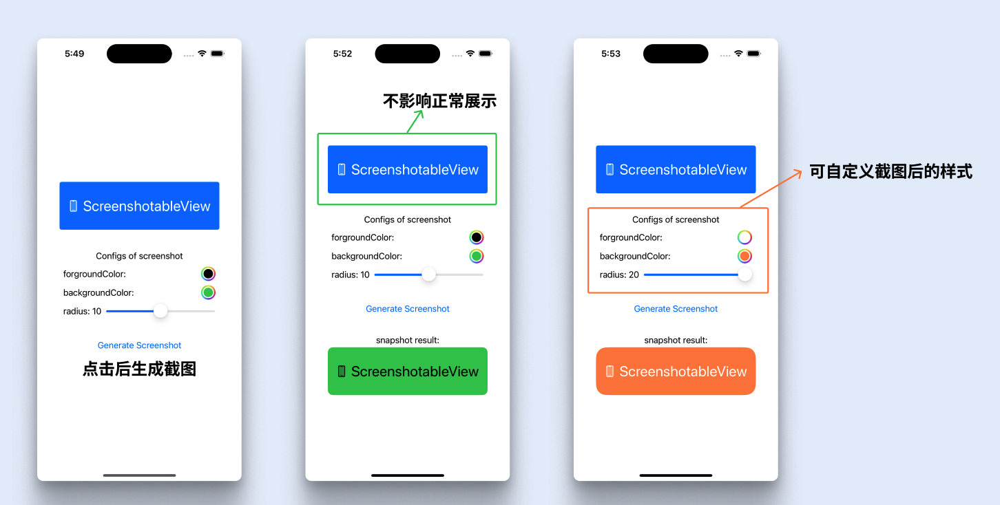

# ScreenshotableView

SwiftUI 中，支持自定义截图的 View


## 🌄 功能图示




## 💻 使用说明

> 也可以直接使用 Example 工程进行查看

1. 直接使用提供截图功能的 View

```swift
ScreenshotableView(shotting: $shotting) { screenshot in
    // 返回 screenshot 截图
} content: { style in
    // 设置 View 内容
    Content(style: style)
}
```

2. 自定义 View 内容

ScreenshotableViewStyle 一共有两种样式，分别是 inView 和 inScreenshot。可以根据 style，设置正常展示时、截图时不同的 UI 样式。

```swift
@ViewBuilder
func Content(style: ScreenshotableViewStyle) -> some View {
    content // 视图内容
  			// 可以根据 style 调整截图时的样式
        // 比如这里正常展示时圆角为 4，截图时圆角为 10
        .cornerRadius(style == .inView ? 4 : 10)
}
```

3. 需要截图时调用

```swift
shotting.toggle()
```


## 🛠 使用 Swift Package Manager 引入工程

通过 Xcode `File > Swift Packages > Add Pacage Dependency...`，再输入 `https://github.com/RickeyBoy/ScreenshotableView` 搜索添加即可
