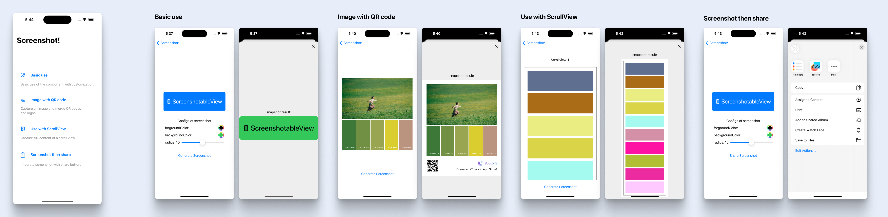

# ScreenshotableView

A View in SwiftUI that supports custom screenshot functionality.

[中文说明](README_CN.md)


## 🌄 Functionality Preview



Download example project and try it!!


## 💻 Usage Instructions

> You can also directly use the Example project for reference.

1. Screenshot

Directly use the provided `ScreenshotableView` with screenshot:

```swift
ScreenshotableView(shotting: $shotting) { screenshot in
    // Return the screenshot image
} content: { style in
    // Set the View content
    Content(style: style)
}
```

Also supports capturing all content within a ScrollView as a long image, by using `ScreenshotableScrollView`.

```swift
ScreenshotableScrollView(shotting: $shotting) { screenshot in
    // Return the screenshot image
} content: { style in
    // No need to nest ScrollView for the content within ScrollView
    Content(style: style)
}
```

2. Customize the View content:

There are two styles for ScreenshotableViewStyle: `inView` and `inScreenshot`. You can adjust the UI style for normal display and when taking a screenshot based on the style.

```swift
@ViewBuilder
func Content(style: ScreenshotableViewStyle) -> some View {
    content // View content
        // Adjust the corner radius based on the style
        // For example, here the corner radius is 4 for normal display and 10 for screenshots
        .cornerRadius(style == .inView ? 4 : 10)
}
```

3. Call when you need to take a screenshot:

```swift
shotting.toggle()
```


## 🛠 Adding to Your Project Using Swift Package Manager

In Xcode, go to `File > Swift Packages > Add Package Dependency...`, then enter `https://github.com/RickeyBoy/ScreenshotableView` to search and add it.
